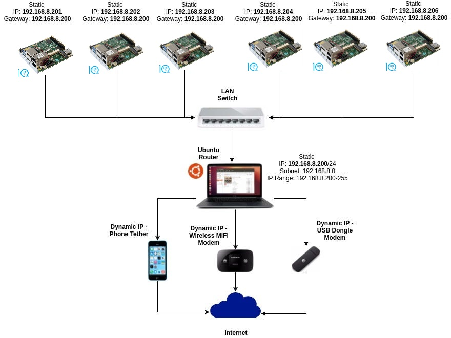

# Custom ISO Editor and Docker Server

## 🎯 Proje Amacı (Project Purpose)

Bu proje, Ubuntu 22.04 Server için otomatik kurulum yapabilen özelleştirilmiş ISO dosyaları oluşturmayı amaçlar. Ana hedefler:

- **Hızlı Kurulum**: UP2 sistemi ve benzeri embedded cihazlar için hızlı kurulum
- **Otomatik Konfigürasyon**: Önceden tanımlanmış ayarlarla tamamen otomatik kurulum
- **Esnek Dağıtım**: İki farklı yöntemle dağıtım (ISO dosyası veya Docker sunucu)
- **APU/APU2 Uyumluluğu**: Endüstriyel bilgisayarlar için optimize edilmiş

## 🏗️ Proje Mimarisi (Project Architecture)

### Sistem Genel Bakış
```
┌─────────────────────────────────────────────────────────────┐
│                    CUSTOM ISO BUILDER                      │
├─────────────────────────────────────────────────────────────┤
│  ┌─────────────────┐         ┌─────────────────────────┐    │
│  │  ISO EDITOR     │         │    DOCKER SERVER       │    │
│  │  - Ubuntu Base  │         │  - HTTP Server          │    │
│  │  - Grub Config  │         │  - Network: 172.20.0.0 │    │
│  │  - User Data    │         │  - Port: 3003           │    │
│  │  - Meta Data    │         │  - Real-time Updates    │    │
│  └─────────────────┘         └─────────────────────────┘    │
└─────────────────────────────────────────────────────────────┘
```

### İki Ana Bileşen (Two Main Components)

1. **custom-iso-editor**: Ubuntu ISO dosyasını özelleştirir
2. **custom-iso-server**: HTTP üzerinden kurulum dosyalarını sunar

Bu proje boyunca, ```kendi .iso dosyamızın USB'de olduğu``` varsayılır.
`grub.cfg` dosyamız, kurulum aşamasında hangi menü bölümüne girdiğimizi belirler.
Varsayılan olarak docker sunucusu üzerinden bağlanmayı hedefliyoruz. Bu şekilde, bir kez yazılan ISO dosyası yerine docker üzerinde çalışan sunucu daha aktif olacaktır.

## 📖 Detaylı Açıklama (Detailed Explanation)

### 🎯 Kurulum Yöntemleri (Installation Methods)

#### Yöntem 1: ISO Dosyası ile Kurulum
**ISO dosyası içindeki `pressed/user-data` düzenlenerek kurulum**

Ubuntu 22.04 Server'da bulunan grub.cfg dosyasında user-data yolunu belirterek hızlı kurulum sağlama amaçlanır. Ubuntu 22.04 server `pressed/user-data` dosyasını düzenleyerek varsayılan olarak gelmesini beklediğimiz tüm dosyaların kurulumu sağlanır.

**Avantajları:**
- Çevrimdışı kurulum mümkün
- Tek seferlik hazırlık
- USB ile taşınabilir

**Dezavantajları:**
- Güncelleme için yeniden ISO oluşturma gerekir
- Esnek olmayan yapı

#### Yöntem 2: Docker Sunucu ile Kurulum
**Docker Sunucu üzerinden `user-data` düzenlenerek kurulum**

Başlangıçta düzenlediğimiz .iso dosyasının içindeki ```grub.cfg``` dosyası her halükarda sabit kalacağından, kurulum aşamasında sadece sunucuyu çalıştırmak yeterlidir. User-data'ya yeni kod eklenirse build edilip sunucunun yeniden başlatılması gerekir.

**Avantajları:**
- Gerçek zamanlı güncelleme
- Merkezi yönetim
- Esnek konfigürasyon
- Ağ üzerinden dağıtım

**Dezavantajları:**
- Ağ bağlantısı gerekir
- Sunucu kurulumu gerekir

### 🌐 Ağ Konfigürasyonu (Network Configuration)

```
Docker Sunucu Ağ Bilgileri:
├── Subnet: 172.20.0.0/16
├── Gateway: 172.20.0.1  
├── Server IP: 172.20.0.2
└── Port: 3003
```

Docker sunucumuz için tanımlanan IP adresi: `subnet=172.20.0.1`
Docker sunucu portu: `port 3003`

## 🔧 user-data Yapısı ve Açıklaması (user-data Structure and Explanation)

### ⚠️ ÖNEMLİ NOTLAR (IMPORTANT NOTES)

```user-data``` örnek kodu github subiquity örneğinden alınmıştır.

**Temel Bileşenler:**
- `early-commands` - Bu kod scriptinde başlangıçta çalışacak ilk kodlar buradan başlar
- `packages` - Yazılacak işletim sisteminde kullanılacak paketlerin eklenmesi
- `late-commands` - ISO dosyasını yazarken son komutlarımız
- `identity` - Her dosyada mutlaka bulunması gereken kimlik bilgileri

Daha fazla içerik için kendi örneklerinizi bulabilirsiniz [örnek bağlantı](https://github.com/canonical/subiquity/tree/main/examples/autoinstall)

### 📋 user-data Örnek Yapısı

```yaml
version: 1
early-commands:
  - echo "Kurulum başlıyor..."
  - sleep 1
  - echo "Sistem hazırlanıyor..."
  
debconf-selections: eek

packages:
  - unzip
  - net-tools
  - curl
  - wget
  
late-commands:
  - echo "Son yapılandırmalar yapılıyor..."
  - sleep 1
  - echo "Kurulum tamamlanıyor..."
  
keyboard:
  layout: tr  # Türkçe klavye düzeni
  
source:
  id: ubuntu-server-minimal
  
updates: security

user-data:
  users:
    - name: user
      passwd: '$6$wdAcoXrU039hKYPd$508Qvbe7ObUnxoj15DRCkzC3qO7edjH0VV7BPNRDYK4QR8ofJaEEF2heacn0QgD.f8pO8SNp83XNdWG6tocBM1'
      groups: [sudo, users]
      shell: /bin/bash
```

### 🔐 Şifre Oluşturma (Password Generation)

Şifre oluşturmak için gerekli şifre üretme kodu:

```bash
# "ubuntu" şifresi için hash oluşturma
openssl passwd -6 -salt $(openssl rand -hex 8) "ubuntu"

# "1" şifresi için hash oluşturma  
openssl passwd -6 -salt $(openssl rand -hex 8) "1"

# Özel şifre için
openssl passwd -6 -salt $(openssl rand -hex 8) "your_password"
```

**Hash Açıklaması:**
- `-6`: SHA-512 algoritması kullanır (güvenli)
- `-salt`: Rastgele salt ekler (güvenlik artırır)
- `$(openssl rand -hex 8)`: 8 baytlık rastgele salt oluşturur

# 🚀 Otomatik ISO Konfigürasyonu (Automatic ISO Configuration)

Bu bölümdeki kodlar makefile içerisinde otomatikleştirilmiştir.

## 🖥️ Donanım Uyumluluğu (Hardware Compatibility)

### APU/APU2 Sistem Desteği

Kodlarımız uçuş bilgileri için APU/APU2 sistemleri ile uyumlu olacak şekilde yazılmıştır. APU sistemi yüksek clock hızlarında çalıştığından performans oldukça iyidir. Bununla uyumlu olmak için kodlarınızda `isolinux` adlı kodları çağırın.

```
Intel'in APU sistemleri daha yüksek clock hızlarına ve daha fazla çekirdeğe sahip olma eğilimindedir. 
Bu özellikler Intel'in APU sistemlerinin CPU tarafında iyi performans göstermesini sağlar. 
İkinci olarak, AMD'nin APU sistemleri Intel'e göre daha fazla popülerlik kazanmıştır.
```

## 📝 Makefile Komutları ve Açıklamaları (Makefile Commands and Explanations)

### Temel Kurulum Komutları

| Komut | Açıklama | Kullanım Zamanı |
|-------|----------|----------------|
| `make iso_depends` | İşletim sistemindeki eksik dosyaları indirir | İlk kurulum |
| `make iso_download` | Ubuntu 22.04 server'ı tanımlanan dosya yapısına direkt indirir | İlk kurulum |
| `make iso_init` | İndirilen iso dosyasını tanımlanan `iso_root` klasörüne çıkarır | İlk kurulum |
| `make iso_setup` | Config klasöründeki kodlarımızı sisteme entegre eder | Her değişiklikten sonra |
| `make iso_setup-isolinux` | Kodlarımızı APU/APU2'ye göre düzenler | APU sistemi için |
| `make iso_geniso` | `iso_root` dosyasını iso formatında sıkıştırır | Standard sistem |
| `make iso_geniso-isolinux` | `iso_root` dosyasından APU/APU2 sistemine göre iso dosyası üretir | APU sistemi için |

### 🔥 Kritik Komut - USB Yazma

```bash
make iso_write_usb
```

**⚠️ DİKKAT:** Bu komut bağlı olan USB'lere en son üretilen iso dosyasının otomatik yüklenmesini sağlar. 
**Cihazınıza USB bağlı olmasın!** Yanlışlıkla önemli verileriniz silinebilir.

### 📊 Komut Sırası Örnekleri

#### İlk Kez Çalıştırma (First Time Setup)
```bash
# Gerekli bağımlılıkları yükle
make iso_depends

# Ubuntu ISO'yu indir
make iso_download

# ISO'yu çıkar ve hazırla
make iso_init

# Konfigürasyonu uygula
make iso_setup
make iso_setup-isolinux

# APU/APU2 için ISO oluştur
make iso_geniso-isolinux
```

#### Sonraki Kullanımlar (Subsequent Uses)
```bash
# Sadece konfigürasyon değiştikten sonra
make iso_setup
make iso_setup-isolinux
make iso_geniso-isolinux

# USB'ye yaz (DİKKATLİ!)
make iso_write_usb
```

## 🐳 Docker Sunucu Kurulumu ve Kullanımı (Docker Server Setup and Usage)

### Ağ Kurulumu Diyagramı

```
┌─────────────────────────────────────────────────────────────┐
│                    AĞ TOPOLOJİSİ                           │
├─────────────────────────────────────────────────────────────┤
│                                                             │
│  [Bilgisayar] ────── [Switch/Router] ────── [UP2 Sistem]   │
│      │                    │                      │         │
│      │                    │                      │         │
│  172.20.0.2           172.20.0.1             DHCP Client   │
│  (Docker Server)      (Gateway)             (Kurulan Sys.) │
│                                                             │
└─────────────────────────────────────────────────────────────┘
```

### 🌐 Ağ Paylaşımı Kurulumu


*İnternetten alınan görsel.*

**Adım Adım Kurulum:**

1. **Bilgisayarınızı herhangi bir router'a bağlayarak**, docker sunucumuzu build etmeli ve ardından çalıştırmalıyız.

2. **Docker Sunucu Oluşturma:**
```bash
# Docker sunucusunu oluştur
make iso_server_build

# Docker sunucusunu çalıştır  
make iso_server_run
```

3. **Ağ Ayarları:**
```
Sunucu IP adresi: 172.20.0.2 
Port: 3003 - host bilgisayarın portuyla çakışma sorunu yaşanmamıştır.
```

### 🔧 Sunucu Yönetimi

#### Sunucu Kabuğuna Bağlanma
```bash
# Sunucu shell'ine bağlan
make iso_server_shell
```

#### Sunucu için Ayarlar
- Sunucu için herhangi bir ayar gerekmez
- Ana bilgisayar switch'e bağlandıktan sonra otomatik kurulumu kendisi gerçekleştirir
- Gerçek zamanlı güncellemeler yapılabilir

### 🔄 Güncelleme Süreci

1. **user-data Dosyasını Güncelleyin**
2. **Docker Sunucusunu Yeniden Oluşturun:**
```bash
make iso_server_build
make iso_server_run
```

3. **Sistem Otomatik Olarak Güncel Konfigürasyonu Alır**

### 🌍 Kullanım Senaryoları

#### Senaryo 1: Tek Seferlik Kurulum
- ISO dosyası hazırla
- USB'ye yaz
- Sisteme tak ve kur

#### Senaryo 2: Çoklu Sistem Kurulumu
- Docker sunucusunu çalıştır
- Tüm sistemlerin ağa bağlanmasını sağla  
- Otomatik kurulum gerçekleşir

#### Senaryo 3: Geliştirme ve Test
- Docker sunucusunda real-time değişiklik yap
- Test sistemlerinde anında dene
- Geri bildirime göre güncelle

## 🔧 Detaylı Konfigürasyon Açıklamaları (Detailed Configuration Explanations)

### 📁 Dosya Yapısı (File Structure)

```
custom_iso/
├── 📄 Makefile                    # Ana makefile
├── 📄 README.md                   # Bu dokümantasyon
├── 📁 custom-iso-editor/          # ISO düzenleme araçları
│   ├── 📄 Makefile               # ISO oluşturma komutları
│   └── 📁 config/                # Konfigürasyon dosyaları
│       ├── 📁 boot/grub/         # GRUB bootloader ayarları
│       ├── 📁 isolinux/          # APU/APU2 boot ayarları
│       ├── 📁 extras/            # Ek dosyalar
│       ├── 📄 user-data          # Otomatik kurulum scripti
│       └── 📄 meta-data          # Meta veriler
├── 📁 custom-iso-server/          # Docker sunucu
│   ├── 📄 Makefile               # Docker komutları
│   ├── 📄 server.Dockerfile      # Docker image tanımı
│   └── 📁 files/                 # Sunucu dosyaları
└── 📁 images/                     # Dokümantasyon görselleri
```

### ⚙️ Makefile Değişkenleri (Makefile Variables)

#### ISO Editor Değişkenleri
```makefile
UBUNTU_VERSION = 22.04.3          # Ubuntu sürümü
UBUNTU_RELEASE = 22.04             # Ubuntu release
ISO_FILENAME = ubuntu-22.04.3-live-server-amd64.iso
ISO_ROOT = ./custom-iso-editor/iso_root    # Çıkarılan ISO klasörü
GENISO_LABEL = UserCustomISO       # Oluşturulan ISO etiketi
```

#### Ağ Değişkenleri
```makefile
GATEWAY = 172.20.0.1               # Ağ geçidi
IP = 172.20.0.2                    # Sunucu IP'si
```

### 🎨 GRUB Konfigürasyonu

GRUB menüsü şu seçenekleri sunar:

```bash
menuentry "Automatic User Installation - HTTP" {
    set gfxpayload=keep
    linux   /casper/vmlinuz quiet autoinstall "ds=nocloud-net;s=http://172.20.0.2:3003"  ---
    initrd  /casper/initrd.lz
}

menuentry "Automatic User Installation - Local" {
    set gfxpayload=keep  
    linux   /casper/vmlinuz quiet autoinstall "ds=nocloud-net;s=file:///cdrom/preseed/"  ---
    initrd  /casper/initrd.lz
}
```

## 🛠️ Sorun Giderme (Troubleshooting)

### ❌ Yaygın Sorunlar ve Çözümleri

#### Problem: "wget: command not found"
```bash
# Çözüm: Gerekli paketleri yükle
sudo apt update
sudo apt install wget curl
```

#### Problem: "xorriso: command not found"
```bash
# Çözüm: ISO araçlarını yükle
make iso_depends
```

#### Problem: Docker ağ hatası
```bash
# Çözüm: Ağı temizle ve yeniden oluştur
make iso_server_clean
make iso_server_build
```

#### Problem: USB yazma başarısız
```bash
# Çözüm: Cihaz izinlerini kontrol et
sudo fdisk -l                    # USB cihazları listele
sudo chmod 666 /dev/sdX          # X yerine cihaz harfi
```

#### Problem: ISO mount edilemiyor
```bash
# Çözüm: Mount noktasını temizle
sudo umount /mnt/user_custom_iso
sudo mkdir -p /mnt/user_custom_iso
```

### 🔍 Debug Komutları

```bash
# Sistem durumunu kontrol et
systemctl status docker

# Ağ bağlantısını test et
ping 172.20.0.2

# Docker container'ları listele
sudo docker ps -a

# Docker ağları listele  
sudo docker network ls

# ISO dosyası geçerliliğini kontrol et
file /path/to/your.iso
```

## 📚 Kullanım Örnekleri (Usage Examples)

### Örnek 1: Geliştirme Ortamı Kurulumu

```bash
# 1. Repoyu klonla
git clone https://github.com/harunkurtdev/custom_iso.git
cd custom_iso

# 2. Bağımlılıkları yükle
make iso_depends

# 3. Ubuntu ISO'yu indir
make iso_download

# 4. Temel kurulumu yap
make iso_init
make iso_setup
make iso_setup-isolinux

# 5. Test ISO'su oluştur
make iso_geniso-isolinux
```

### Örnek 2: Üretim Sunucusu Kurulumu

```bash
# 1. Docker sunucusunu hazırla
make iso_server_build

# 2. Ağ ayarlarını yapılandır
# Router IP: 172.20.0.1 olarak ayarla

# 3. Sunucuyu başlat
make iso_server_run

# 4. Test bağlantısı
curl http://172.20.0.2:3003/user-data
```

### Örnek 3: Özelleştirilmiş Kurulum

1. **user-data dosyasını düzenle:**
```yaml
# custom-iso-editor/config/user-data
autoinstall:
  version: 1
  identity:
    realname: "Şirket Kullanıcısı"
    hostname: "sirket-server"
    username: "admin"
    password: "$6$..." # openssl ile oluştur
  packages:
    - nginx
    - nodejs
    - docker.io
  late-commands:
    - systemctl enable nginx
    - systemctl enable docker
```

2. **ISO'yu yeniden oluştur:**
```bash
make iso_setup
make iso_geniso-isolinux
```

## 🎯 İleri Seviye Kullanım (Advanced Usage)

### Özelleştirme Seçenekleri

#### 1. Ek Paket Kurulumu
```yaml
packages:
  - build-essential
  - python3-pip
  - git
  - vim
  - htop
  - curl
  - wget
```

#### 2. Özel Script Çalıştırma
```yaml
late-commands:
  - cp /cdrom/extras/custom-script.sh /target/home/user/
  - chmod +x /target/home/user/custom-script.sh
  - curtin in-target --target=/target -- /home/user/custom-script.sh
```

#### 3. SSH Key Kurulumu
```yaml
user-data:
  users:
    - name: user
      ssh_authorized_keys:
        - "ssh-rsa AAAAB3NzaC1yc2EAAAA... user@hostname"
```

### Performans Optimizasyonu

#### ISO Boyutunu Küçültme
```bash
# Gereksiz dosyaları temizle
rm -rf ${ISO_ROOT}/pool/restricted/*
rm -rf ${ISO_ROOT}/pool/multiverse/*
```

#### Kurulum Hızını Artırma
```yaml
# Minimal paket seçimi
source:
  id: ubuntu-server-minimal
  
# Hızlı ağ ayarları
network:
  version: 2
  ethernets:
    any:
      match:
        name: "e*"
      dhcp4: true
```

## 🔒 Güvenlik Önerileri (Security Recommendations)

### 1. Güçlü Şifre Kullanımı
```bash
# Güçlü şifre oluştur
openssl passwd -6 -salt $(openssl rand -hex 16) "SuperGüçlüŞifre123!"
```

### 2. SSH Anahtarı Kullanımı
```bash
# SSH anahtar çifti oluştur
ssh-keygen -t rsa -b 4096 -C "admin@company.com"
```

### 3. Firewall Ayarları
```yaml
late-commands:
  - curtin in-target --target=/target -- ufw enable
  - curtin in-target --target=/target -- ufw default deny incoming
  - curtin in-target --target=/target -- ufw allow ssh
```

## 📊 Performans Metrikleri

### Kurulum Süreleri

| Yöntem | Ortalama Süre | Ağ Gereksinimi |
|--------|---------------|----------------|
| Local ISO | 15-20 dakika | Hayır |
| Docker Server | 10-15 dakika | Evet |
| Minimal Install | 8-12 dakika | Ağa göre değişir |

### Sistem Gereksinimleri

| Bileşen | Minimum | Önerilen |
|---------|---------|----------|
| RAM | 2GB | 4GB+ |
| Disk | 10GB | 20GB+ |
| CPU | 1 çekirdek | 2+ çekirdek |
| Ağ | 10Mbps | 100Mbps+ |

## 🏁 Sonuç ve Öneriler (Conclusion and Recommendations)

### ✅ Bu Sistemin Avantajları

1. **Hızlı Dağıtım**: Dakikalar içinde sistem kurulumu
2. **Merkezi Yönetim**: Docker sunucu ile tek noktadan kontrol
3. **Esneklik**: İki farklı kurulum yöntemi
4. **Otomatik Yapılandırma**: El ile müdahale gerektirmez
5. **APU/APU2 Uyumluluğu**: Endüstriyel sistem desteği

### 🎯 Kullanım Alanları

- **IoT Cihaz Kurulumu**: Toplu sensor kurulumları
- **Edge Computing**: Uç bilgisayarlarda hızlı dağıtım  
- **Test Laboratuvarları**: Sürekli sistem kurulumu/yenilenmesi
- **Üretim Hatları**: Standart sistem imajları
- **Eğitim Ortamları**: Öğrenci laboratuvarları

### 🔮 Gelecek Geliştirmeler

- [ ] Web tabanlı yönetim arayüzü
- [ ] Çoklu Ubuntu sürüm desteği
- [ ] Grafik arayüzlü kurulum seçenekleri
- [ ] Sistem metriklerini izleme
- [ ] Otomatik güncelleme sistemi

### 📞 Destek ve Katkı

**Sorun Bildirimi:**
- GitHub Issues kullanın
- Detaylı hata logları ekleyin
- Sistem bilgilerinizi paylaşın

**Katkıda Bulunma:**
1. Repository'i fork edin
2. Feature branch oluşturun
3. Değişikliklerinizi commit edin
4. Pull request gönderin

### 📚 Referanslar ve Kaynaklar

- [Ubuntu Subiquity Autoinstall](https://github.com/canonical/subiquity/tree/main/examples/autoinstall)
- [Cloud-init Documentation](https://cloud-init.readthedocs.io/)
- [ISO 9660 Standard](https://en.wikipedia.org/wiki/ISO_9660)
- [Docker Networking](https://docs.docker.com/network/)
- [APU/APU2 Documentation](https://pcengines.ch/)

---

**© 2024 Harun Kurt Development Team**

*Bu proje MIT lisansı altında dağıtılmaktadır. Kullanım, değişiklik ve dağıtım serbesttir.*

---

### 🔧 Son Notlar

Bu dokümantasyon, "burayı baya açıkla" talebine uygun olarak hazırlanmış kapsamlı bir açıklama içermektedir. Sistem hakkında daha fazla bilgi için dokümantasyonun ilgili bölümlerini inceleyebilir, örnekleri takip edebilir ve troubleshooting rehberini kullanabilirsiniz.

**Önemli Hatırlatma:** USB yazma işlemlerinde dikkatli olun ve yedeklerinizi alın!

### Ağ Kurulumu Diyagramı

```
┌─────────────────────────────────────────────────────────────┐
│                    AĞ TOPOLOJİSİ                           │
├─────────────────────────────────────────────────────────────┤
│                                                             │
│  [Bilgisayar] ────── [Switch/Router] ────── [UP2 Sistem]   │
│      │                    │                      │         │
│      │                    │                      │         │
│  172.20.0.2           172.20.0.1             DHCP Client   │
│  (Docker Server)      (Gateway)             (Kurulan Sys.) │
│                                                             │
└─────────────────────────────────────────────────────────────┘
```

### 🌐 Ağ Paylaşımı Kurulumu


*İnternetten alınan görsel.*

**Adım Adım Kurulum:**

1. **Bilgisayarınızı herhangi bir router'a bağlayarak**, docker sunucumuzu build etmeli ve ardından çalıştırmalıyız.

2. **Docker Sunucu Oluşturma:**
```bash
# Docker sunucusunu oluştur
make iso_server_build

# Docker sunucusunu çalıştır  
make iso_server_run
```

3. **Ağ Ayarları:**
```
Sunucu IP adresi: 172.20.0.2 
Port: 3003 - host bilgisayarın portuyla çakışma sorunu yaşanmamıştır.
```

### 🔧 Sunucu Yönetimi

#### Sunucu Kabuğuna Bağlanma
```bash
# Sunucu shell'ine bağlan
make iso_server_shell
```

#### Sunucu için Ayarlar
- Sunucu için herhangi bir ayar gerekmez
- Ana bilgisayar switch'e bağlandıktan sonra otomatik kurulumu kendisi gerçekleştirir
- Gerçek zamanlı güncellemeler yapılabilir

### 🔄 Güncelleme Süreci

1. **user-data Dosyasını Güncelleyin**
2. **Docker Sunucusunu Yeniden Oluşturun:**
```bash
make iso_server_build
make iso_server_run
```

3. **Sistem Otomatik Olarak Güncel Konfigürasyonu Alır**

### 🌍 Kullanım Senaryoları

#### Senaryo 1: Tek Seferlik Kurulum
- ISO dosyası hazırla
- USB'ye yaz
- Sisteme tak ve kur

#### Senaryo 2: Çoklu Sistem Kurulumu
- Docker sunucusunu çalıştır
- Tüm sistemlerin ağa bağlanmasını sağla  
- Otomatik kurulum gerçekleşir

#### Senaryo 3: Geliştirme ve Test
- Docker sunucusunda real-time değişiklik yap
- Test sistemlerinde anında dene
- Geri bildirime göre güncelle